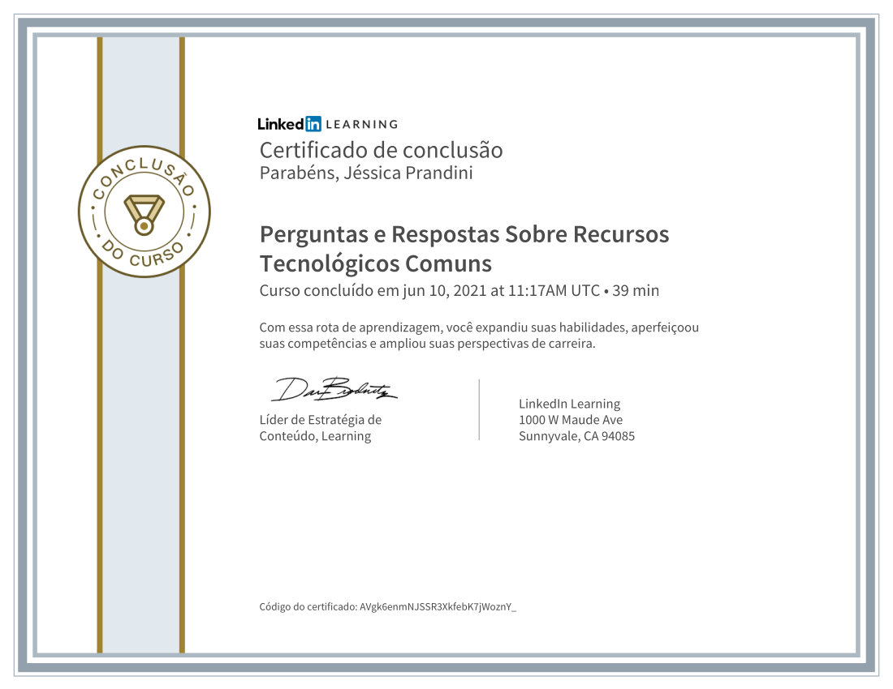
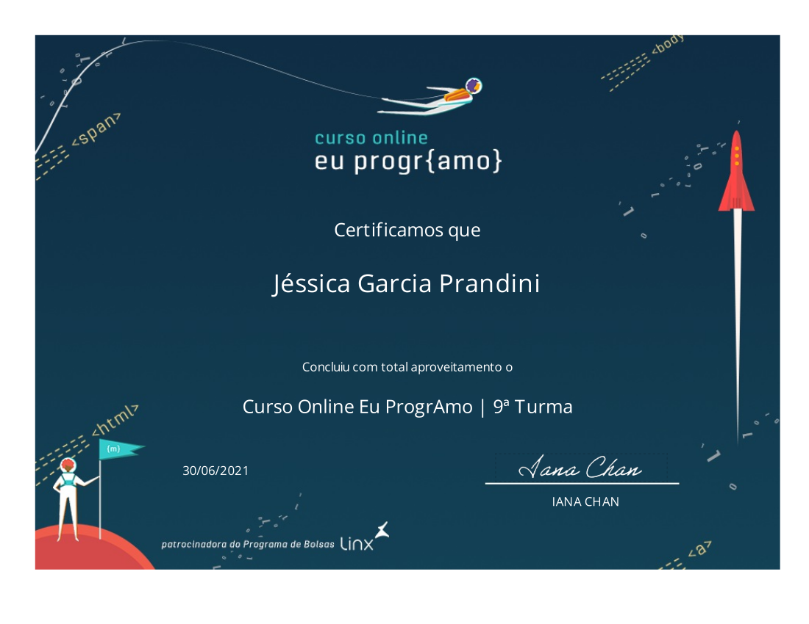
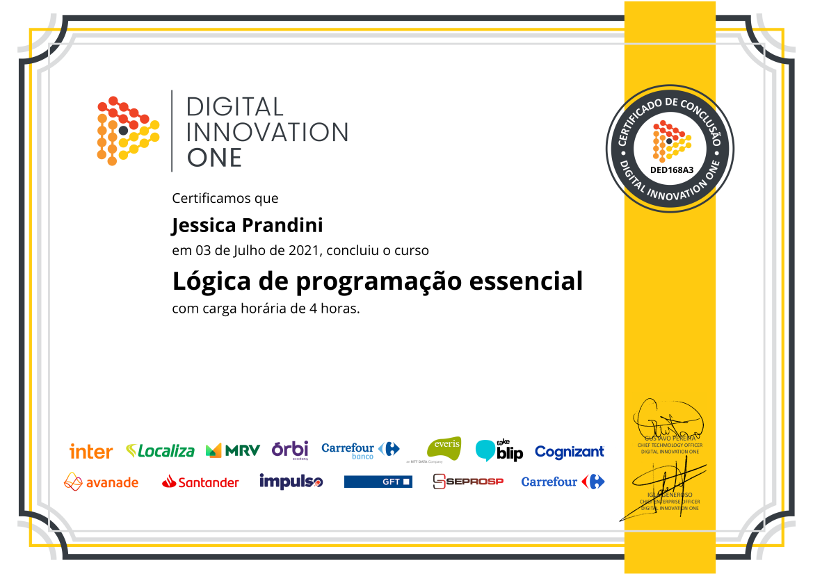
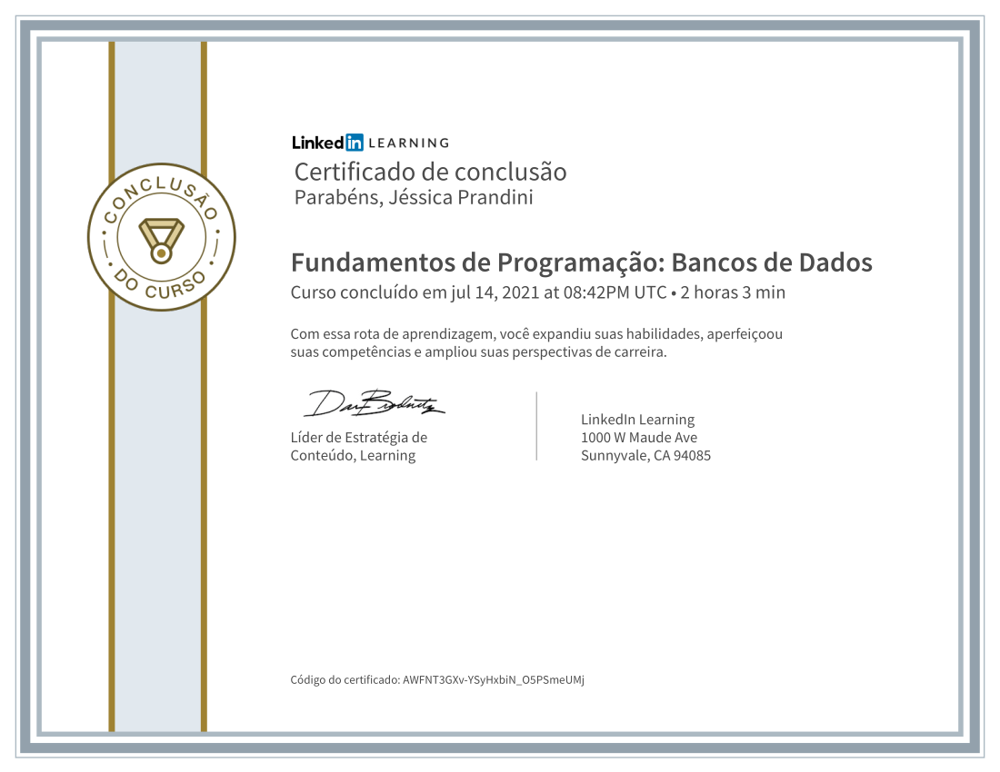

# certificados

Certificados de cursos concluídos.

###  Junho 2021

#### - Perguntas e Respostas Sobre Recursos Tecnológicos Comuns

Este curso fornece respostas simples para perguntas comuns sobre os recursos tecnológicos usados no dia a dia: software, hardware e outros elementos, das pesquisas no Google aos serviços de localização do smartphone. Descubra se as redes Wi-Fi são confiáveis, por que seu computador apresenta lentidão, como lidar com e-mails suspeitos e muito mais. Jess Stratton, instrutora do LinkedIn Learning e especialista em produtividade, revela o mistério por trás da tecnologia moderna, para que você possa seguir em frente e aumentar sua produtividade.

URL do Curso: https://www.linkedin.com/learning/perguntas-e-respostas-sobre-recursos-tecnologicos-comuns

Instituição: [Linkedin Learning](https://www.linkedin.com/learning)

#### - Curso Online EuProgrAmo

Curso de introdução à programação com foco em desenvolvimento web. Nele, você vai dar o primeiro passo da sua jornada e fazer sua primeira página web.

URL do Curso: https://www.programaria.org/curso-online-euprogramo/

Instituição: [Programaria](https://www.programaria.org)

###  Julho 2021

#### - Lógica de programação essencial

Lógica de programação é a forma como o desenvolvedor entende a comunicação a fim de programar uma função de um programa. Faz uso de algoritmos, que são sequências de passos bem estabelecidos, como por exemplo, uma receita de bolo.

URL do Curso: https://web.digitalinnovation.one/course/logica-de-programacao-essencial-1

Instituição: [Digital Innovation One](https://digitalinnovation.one/)

#### - Introdução ao Git e ao GitHub

Esse curso ensina um pouco da história do Git e como ele se tornou essencial para otimizar projetos dos desenvolvedores. Também vamos conhecer seus principais comandos, como funciona a plataforma e como ela pode simplificar o seu trabalho.

URL do Curso: https://web.digitalinnovation.one/course/introducao-ao-git-e-ao-github

Instituição: [Digital Innovation One](https://digitalinnovation.one/)

#### - Fundamentos de Programação: Bancos de Dados

Este curso fornece os básicos necessários para você começar a criar e usar bancos de dados. Explore a terminologia: formas normais, ACID, CRUD, integridade referencial, transações, registros e tabelas. Aprenda o papel das chaves primárias e valores exclusivos em um modelo relacional. 

URL do Curso: https://www.linkedin.com/learning/fundamentos-de-programacao-bancos-de-dados

Instituição: [Linkedin Learning](https://www.linkedin.com/learning)
